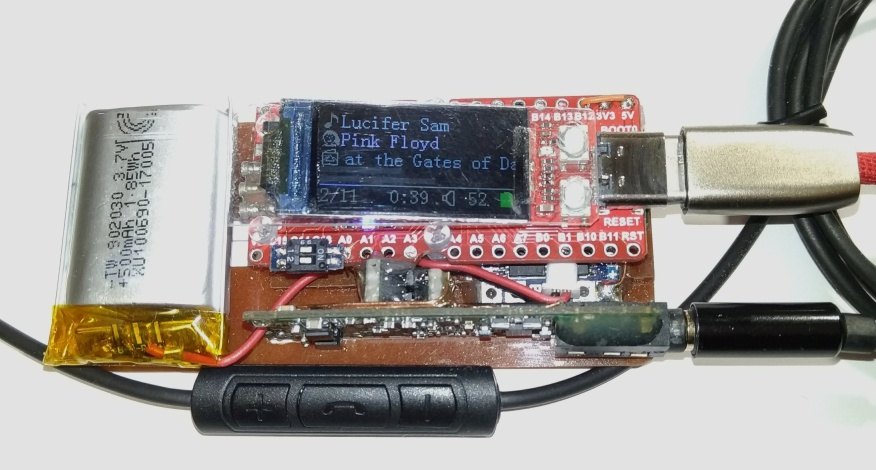

# gd32v_WAV_Player

## Features
* 44.1KHz 16bit Stereo WAV File
* ES9023 24bit Audio DAC
* ExFAT MicroSD (up to 512GB)
* Tag information by LIST chunk
* Cover Art display by RGB565 binary format file
* Folder/File navigation by ASCII order
* Control by Android Headphone button (3 buttons)
* Volume by utilizing DAC 24bit range for playing 16bit Audio data
* Album unit random play by time out after play finish (Assuming [Artist Folder]/[Album Folder] structure)
* Resume playback
* Battery voltage check (Optional: external circuit needed)

### Not supported
* Multi-byte string file name
* Unicode Tag information
* Fast Forward / Fast Rewind
* Gapless playback

## Button Control Guide
Connect MIC pin of Android headphone remote control with 3 buttons to PA0 pin of Longan Nano.
PA0 also needs to be pulled-up by 2.2Kohm from 3.3V.

### FileView Mode
* Up/Down button to go up/down
* Center 1 click to get into the folder
* Center 1 click to play WAV file (go to Play Mode)
* Center 2 click to go parent folder
* Center 3 click to random album play (go to Play Mode)

### Play Mode
* Up/Down button for volume up/down
* Center 1 click to pause/play
* Center 2 click to stop (go back to FileView Mode)

### Power On/Off (Optional: external circuit needed)
Long push Center button

## DAC ES9023 I2S pins

| ES9023 Pin No. | ES9023 Pin Name | Longan Nano Pin |
----|----|---- 
| 1 | BCK | PB3 |
| 2 | LRCK | PA15 |
| 3 | SDI | PB5 |
| 13 | MCLK | PA8 |
| 15 | MUTE_B | PB6 |

## Schematic
[Sipeed_Longhan_Nano_WAV_Player_schematic.pdf](doc/Sipeed_Longhan_Nano_WAV_Player_schematic.pdf)

## Cover Art File
* Put "cover.bin" on each Album Folder
* File Format: 80 Pixels x 80 Pixels RGB565 Binary format
* [cover.bin example](script/cover.bin)
* Use [jpg2bin.py](script/jpg2bin.py) to convert into cover.bin
