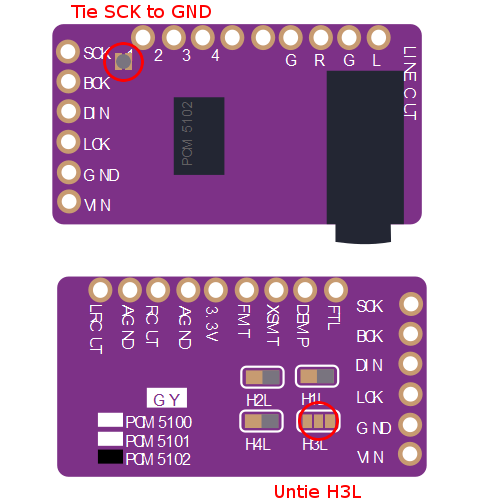

# gd32v_WAV_Player
## Features
### Supported
* Sipeed Longan Nano: 128KB Flash/32KB SRAM
* Lilygo TTGO T-Display-GD32: 128KB Flash/32KB SRAM
* ES9023 24bit I2S Audio DAC
* PCM5102 32bit I2S Audio DAC
* exFAT MicroSD (up to 512GB)
* 44.1KHz 16bit Stereo WAV File
* Tag information by LIST chunk in WAV File
* Cover Art display by RGB565 binary format file
* Folder/File navigation by ASCII order
* Control by Android Headphone button (3 buttons)
* Volume by utilizing DAC 24bit/32bit range for playing 16bit Audio data
* Album unit random play by time out after play finish (Assuming [Artist Folder]/[Album Folder] structure)
* Resume playback
* Battery voltage check (Optional: external circuit needed)

### Not supported
* Sipeed Longan Nano: 64KB Flash/20KB SRAM
* Multi-byte string file name
* Unicode Tag information
* Fast Forward / Fast Rewind
* Gapless playback

## Board Configuration
* Edit [board_conf.h](include/board_conf.h) to choose your board

## Pin Assignment
In addition to original connection

| Longan Nano Pin | Function | Connection |
----|----|----
| PA0 | ADC0_CH0 | from Android Head Phone MIC (Button) |
| PA3 | ADC1_CH3 | from Battery Voltage |
| PA8 | CK_OUT0 |  to ES9023 MCLK (13) |
| PA15 | I2S2_WS | to ES9023 LRCK (2) / to PCM5102 LRCK (15) |
| PB3 | I2S2_CK | to ES9023 BCK (1) / to PCM5102 BCK (13) | 
| PB5 | I2S2_SD | to ES9023 SDI (3) / to PCM5102 DIN (14) |
| PB6 | GPIO | to ES9023 MUTE_B (15) / to PCM5102 XSMT (17) | 
| PB7 | TIM3_CH1 | to LCD Backlight PWM Control (modify Longan Nano) |
| PB8 | GPIO | to Battery Check |
| PB10 | TIM1_CH2 | to LCD Backlight PWM Control (Lilygo GD32) |
| PC14 | GPIO | to Power Keep |

tie PCM5102 SCK (12) to low 

## I2S DAC
Both ES9023 and PCM5102 are supported without selection.
### PCM5102 Board Setting

## Button Control Guide
Connect MIC pin of Android headphone remote control with 3 buttons to PA0 pin of Longan Nano.
PA0 also needs to be pulled-up by 2.2Kohm from 3.3V. See schematic for detail.

### FileView Mode
* Up/Down button to go up/down for file selection
* Center 1 click to get into the folder
* Center 1 click to play WAV file (go to Play Mode)
* Center 2 click to go parent folder
* Center 3 click to random album play (go to Play Mode)

### Play Mode
* Up/Down button for volume up/down
* Center 1 click to pause/play
* Center 2 click to stop (go back to FileView Mode)

### Power On/Off (Optional: external circuit needed)
* Long push Center button

## Schematic
[Sipeed_Longhan_Nano_WAV_Player_schematic.pdf](doc/Sipeed_Longhan_Nano_WAV_Player_schematic.pdf)

## Cover Art File
* Put "cover.bin" on each Album Folder
* File Format: 80 Pixels x 80 Pixels RGB565 Binary format
* [cover.bin example](script/cover.bin)
* Use [jpg2bin.py](script/jpg2bin.py) to convert into cover.bin

## Opening Logo File
### Sipeed Longan Nano
* Put "logo.bin" on root Folder
* File Format: 160 Pixels x 80 Pixels RGB565 Binary format
* [logo.bin example](resource/logo.bin)
### Lilygo TTGO T-Display-GD32
* Put "lilygo_logo.bin" on root Folder
* File Format: 240 Pixels x 135 Pixels x n Frames RGB565 Binary format
* [lilygo_logo.bin example](resource/lilygo_logo.bin)

## Prototype Example
### Portable WAV Player (Sipeed Longan Nano with ES9023)
  
[Scene2](doc/gd32v_WAV_Player_inside_case.jpg)
[Scene3](doc/gd32v_WAV_Player_with_case.jpg)
### Sipeed Longan Nano with PCM5102

### Lilygo TTGO T-Display-GD32
  
[Scene6](doc/gd32v_WAV_Player_lilygo_gd32_fileview.jpg)
