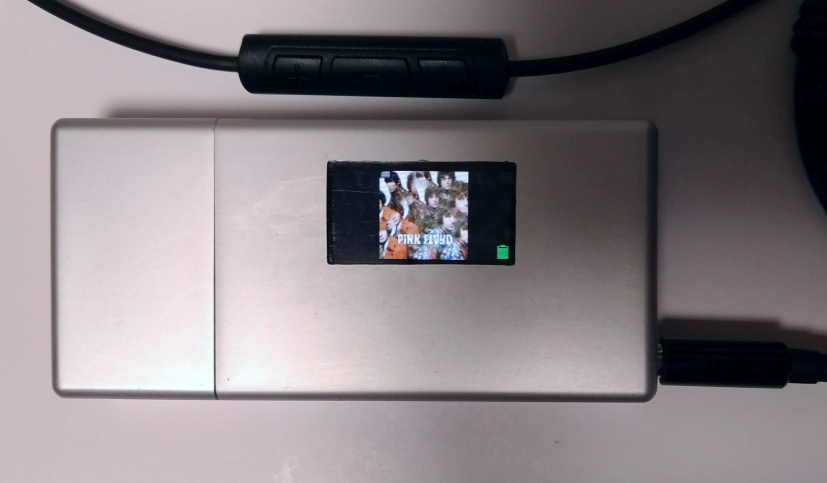

# gd32v_WAV_Player

## Features
* 44.1KHz 16bit Stereo WAV File
* ES9023 24bit Audio DAC
* Tag information by LIST chunk
* Cover Art display by original format binary file
* ExFAT MicroSD (up to 512GB)
* Folder/File navigation by ASCII order
* Remote control by Android Headphone button (3 buttons)
* DAC volume (utilizing 24bit resolution for playing 16bit Audio data)
* Album unit random play by time out after play finish (Assuming [Artist Folder]/[Album Folder] structure)
* Resume playback

### Not supported
* Multibyte string file name
* Unicode Tag information
* Fast Forward / Fast Rewind
* Gapless playback

## Button Control Guide
Connect MIC pin of Android headphone remote control with 3 buttons to PA0 pin of Longan Nano.
PA0 also needs to be pulled-up by 2.2Kohm from 3.3V.

### FileView Mode
* Up/Down button to go up/down
* Center 1 click to get into the folder
* Center 1 click to play the wav file (go to Play Mode)
* Center 2 click to go parent folder
* Center 3 click to random album play (go to Play Mode)

### Play Mode
* Up/Down button for volume up/down
* Center 1 click to pause/play
* Center 2 click to stop (go back to FileView Mode)

### Power On/Off (Optional: external circuit needed)
Long push Center button

## Timeout Actions
### Auto Random Play condition
* 1min after whole files play finished

### Auto Power Off condition (Optional: external circuit needed)
* 3min idle in FileView mode (except for Auto Rndom Play condition)
* 3min pause in Play mode

## DAC ES9023 I2S pins

| ES9023 Pin No. | ES9023 Pin Name | Longan Nano Pin |
----|----|---- 
| 1 | BCK | PB3 |
| 2 | LRCK | PA15 |
| 3 | SDI | PB5 |
| 13 | MCLK | PA8 |
| 15 | MUTE_B | PB6 |

